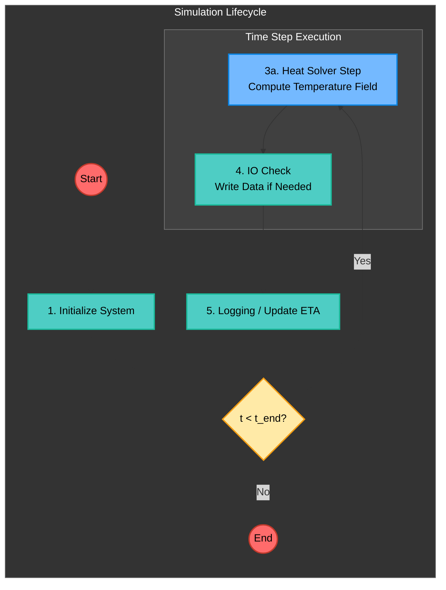

# fastHeatSolv

**A semi-analytical, modular solution for the heat equation with support for CPU/GPU backends and G-code-driven laser paths.**


---

## Table of Contents

- [Overview](#overview)
- [Installation](#installation)
- [Usage](#usage)
- [Output & Visualization](#output--visualization)
- [Architecture](#architecture)
- [Citation](#citation)

---

## Overview

fastHeatSolv is a modular framework for simulating heat transfer in additive manufacturing. It uses semi-analytical spectral methods for high performance on both CPU and GPU, and supports complex laser trajectories defined via G-code.

Key features:
- **Fast Spectral Solvers**: GPU-accelerated (via CuPy) and CPU-optimized (NumPy/SciPy).
- **G-Code Support**: Direct simulation of toolpaths from printer instructions.
- **Modular Design**: Extensible via Abstract Factory pattern (see [Architecture](docs/ARCHITECTURE.md)).

### Solver Logic

The solver logic is detailed hereafter.


## Installation

This project uses `uv` for fast, reliable dependency and virtual environment management.

### Prerequisites
- Install `uv` (https://uv.io)
- Python 3.9+
- CUDA Toolkit (Optional, for GPU backend)

### Setup
1. Clone the repository:
```bash
git clone https://github.com/TheoADX/fastHeatSolv.git
cd fastHeatSolv
```

2. Install dependencies and build the environment

By running the commands below, `uv` will automatically create a virtual environment (`.venv`) and install the exact dependencies needed. You can decide exactly what environment you want to build.

Install CPU core only (Recommended for standard use):

```bash
uv sync
```

Install for GPU execution:

```bash
uv sync --extra gpu
```

Install everything (GPU + Visualization + Dev tools):

```bash
uv sync --all-extras
```

If you prefer to install the package itself in editable mode you can use `pip` directly.

```bash
python -m pip install -e .

# With GPU support (requires CUDA 12.x)
python -m pip install -e ".[gpu]"
```

### Usage
Run a simulation by pointing `main.py` to a configuration file. Because `uv` manages the environment, use `uv run` to execute scripts without needing to manually activate the virtual environment:

```bash
uv run python simulations/main.py simulations/config/fast_test.yaml
```

To enable GPU acceleration, ensure your config file (`simulations/config/*.yaml`) has:

```yaml
simulation:
  backend: "gpu"
```

## Usage

Run a simulation by pointing `main.py` to a configuration file:

```bash
python simulations/main.py simulations/config/fast_test.yaml
```

To enable GPU acceleration, ensure your config file (`simulations/config/*.yaml`) has:
```yaml
simulation:
  backend: "gpu"
```

### Configuration
Configuration is handled via YAML files in the `config/` directory. See `config/fast_test.yaml` for a documented example of parameters (domain size, material properties, laser path).

## Output & Visualization

Results are saved to `out/<timestamp>_<tag>/`:
- **Fields**: `.h5` / `.xmf` (Open with ParaView).
- **Profiles**: `.txt` temperature profiles.
- **Cut Views**: `.png` meltpool profiles
- **Logs**: Execution logs.

## Architecture

(see [Architecture](docs/ARCHITECTURE.md)).

## Citation

If you use this code in your research, please cite:

TBW


```yaml
simulation:
  name: "spectral_test_run"
  method: "spectral"          # Options: "spectral", "fem"
  backend: "cpu"              # Options: "cpu" (standard), "gpu" (if supported)
  duration: 0.012             # s
  dt: 6.0e-6                  # s
  update_interval: 20         # steps (ETA update frequency)

domain:
  size: [0.01, 0.005, 0.0025] # [Lx, Ly, Lz] in m
  mesh: [512, 256, 1024]      # [nx, ny, nz] (dimensionless)

material:
  name: "GenericSteel"
  rho: 7850.0                 # kg/m^3
  k: 15.0                     # W/(m·K)
  Cp: 500.0                   # J/(kg·K)
  L_f: 267700.0               # J/kg (Latent heat of fusion)
  T_solidus: 1700.0           # K
  T_liquidus: 1800.0          # K
  T0: 293.0                   # K (Ambient temperature)
  
  # Evaporation parameters
  DeltaH_LV: 7.41e6           # J/kg (Specific enthalpy of vaporization)
  R_v: 150.774                # J/(kg·K) (Specific gas constant for vapor)
  Pa: 101325.0                # Pa (Ambient pressure)
  T_boil: 3090.0              # K

laser:
  radius: 60.0e-6             # m (r_b)
  absorptivity: 0.30          # (dimensionless, 0.0 to 1.0)
  power_nominal: 200.0        # W
  
  path:
    type: "gcode"
    file: "linear_track.gcode"
    initial_position: [0.0, 0.0025] # [x, y] in m

io:
  interval: 0.0012            # s (Output frequency)
  outputs: [full_volume]      
  at_end: [full_volume, profiles, cut_views]  
  profiles_locations:
    - 'laser'                 # Location in m or 'laser' for dynamic center
  cut_views_planes:
    - xy
    - yz
    - xz
```

**IO Section Details:**

- `interval`: How often to save outputs during the simulation (in seconds).
- `outputs`: List of output types to save at each interval (e.g., `full_volume`).
- `at_end`: List of output types to save at the end of the simulation (e.g., `profiles`, `cut_views`).
- `profiles_locations`: Optional, (x,y) tuple or 'laser' or 'hotspot'.
- `cut_views_planes`: Optional, planes for extracting 2D cut views.


### 2. Laser Path Strategy

The solver uses a consistent reference frame: the top surface is always $z = L_z$.

```
 +Z (BUILD DIRECTION)
            ^          ^  +y
            |         /
            |        /
            | +=====================+   <-- Top Layer, Lasered (z = Lz)
            |/=====================/|
            +====================+  |
            |                    |  |
            |        CUBOID      |  +
            |        (PART)      | /   <-- Base Layer sits on platform
(X,Y,Z=0)   |                    |/
ORIGIN >----+====================+--------------------> +X
                 ( X-Y Plane)
```

The `LaserPath` interface decouples heat source physics (e.g., Gaussian) from movement logic:

```python
class LaserState(dataclass):
    x: float
    y: float
    power: float
    is_on: bool

class LaserPath(ABC):
    @abstractmethod
    def get_state(self, time: float) -> LaserState:
        """Returns laser position and power at a given simulation time."""
        pass

class GCodeLaserPath(LaserPath):
    def __init__(self, gcode_file: str):
        self.segments = self._parse_gcode(gcode_file)
        # Segments would contain: (start_pos, end_pos, start_time, end_time, power)
    
    def _parse_gcode(self, filepath):
        # Parses G0 (move), G1 (linear cut), M words for power
        # Calculates timing based on F (feed rate)
        pass
```

### 3. Unified Parameter Object

All configuration sections are deserialized into a unified `SimulationContext` object passed to the Abstract Factory.

```python
@dataclass
class SimulationContext:
    num: NumParams
    geom: GeomParams
    mat: MaterialParams
    laser_path: LaserPath
    io: IOParams
    method: str = "spectral"
    backend: str = "cpu"
```

#### Flexible Output Control

The `io` section allows fine-grained control over what is saved and when:

- `full_volume`: Save the full 3D field at intervals and/or at the end
- `profiles`: Save 1D temperature profiles at specified locations
- `cut_views`: Save 2D slices (xy, yz, xz) at intervals or at the end

This enables efficient disk usage and post-processing tailored to your needs.

---

## Development Roadmap

- [ ] **Update Logic**: Enable the solver to load a previous known temperature field
- [ ] **Adding Material**: Change the domain definition on the fly to
    - Account for an added layer of material
- [ ] **API Design**: Enable calls from an external Orchestrator / Adapter
- [ ] **CFL and discretisation**: Add physics based warning (CFL, number of modes, discretization)
- [ ] **Custom flux**: Enable user to write custom boundary flux (less hardcoded)
- [ ] **Boundary Condition Modularity**: Enable user to choose BCs freely (less hardcoded)
- [ ] **Unit Tests**: Write and use unit tests
- [ ] **Remove CPU LINEAR**: It was for test purposes
---

Proposition 1 for Modular Boundary Conditions : (easy)
User writes boundary condition in the yaml choosing among a set of predefined BoundaryFlux class


```yaml
boundaries:
  top:
    - type: RadiationBoundary
      emissivity: 0.8
      T_inf: 293.0
    - type: custom_user_module.MyLaserPulseFlux # Example Python code hook
  bottom:
    - type: ConvectionBoundary
      h: 15.0
      T_inf: 293.0
```

Proposition 2 for Modular Boundary Condition : (harder)
User writes his main depending on needs, a parser can read the expressions. Then injected in the solver. 

```python
def main():
    config = load_config(args.config)
    context = SimulationContext.from_dict(config)
    factory = get_factory(context)
    runner = StandaloneHeatRunner(context, factory)

    # --- User defined formula parser ---
    x, y, t, T = sp.symbols('x y t T')
    
    # Example : Radiation boundary (Stefan-Boltzmann)
    # sigma = 5.67e-8, epsilon = 0.8, T_inf = 293
    # flux = -0.8 * 5.67e-8 * (T**4 - 293.0**4)
    
    # Example : Custom moving heat source
    flux_expr = 1e6 * sp.exp(-((x - 0.005)**2 + (y - 0.005)**2) / 0.0001) * sp.sin(2 * sp.pi * t * 100)**2 
    
    # Compile (see if needed)
    fast_flux_func = sp.lambdify((x, y, t, T), flux_expr, modules=['numexpr', 'numpy'])
    
    # Inject into solver
    runner.solver.set_top_flux(fast_flux_func)
    # Provide also .set_bottom_flux ...
    # -----------------------------------
```

