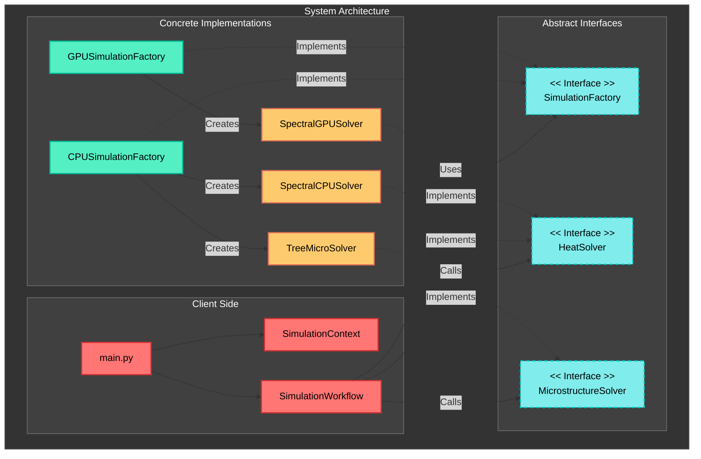

# Architecture & Design

The project is structured around the **Abstract Factory** pattern, enabling easy extension to new backends (CPU, GPU, distributed) and numerical methods (Spectral, FEM, etc.).

## Directory Structure

```text
fastHeatSolv/
├── main.py                     # Entry point: parses args, instantiates SimulationFactory
├── config/                     # YAML configuration files for simulation parameters
├── data/
│   └── paths/                  # G-code files for laser paths
├── out/                        # Simulation results (per-run subfolders)
├── core/
│   ├── workflow.py             # Simulation loop (orchestrator, strategy pattern)
│   ├── parameters.py           # Data classes: PhysParams, NumParams, GeomParams, IOParams
│   └── io.py                   # Abstract base class for IOManager
├── interfaces/
│   ├── factory.py              # Abstract Factory: interface for creating solvers, IO managers
│   └── solver.py               # Abstract Product: HeatSolver interface
├── implementations/
│   ├── factories/              # Concrete Factories (CPU, GPU, FEM)
│   ├── solvers/                # Concrete Solvers (Spectral, FEM wrappers)
│   ├── file_io/                # Concrete IO Managers
│   └── physics/                # Low-level physics kernels
└── utils/                      # Utilities (DCT, visualization, logging)
```

## Component Descriptions

- **Client (`main.py`)**: Entry point that parses arguments (CLI/YAML) and injects the appropriate Factory into the Workflow.
- **Workflow (`core/workflow.py`)**: The high-level director that manages the time loop, physics updates, and IO events.
- **Factory Interface (`interfaces/factory.py`)**: Abstract definitions for creating solvers and managers.
- **Solvers (`implementations/solvers/`)**: The mathematical engines.

## Extending the Framework

To add a new solver (e.g., Finite Difference):
1. Create `interfaces/solver.py` compliant implementation in `implementations/solvers/`.
2. Create a factory in `implementations/factories/`.
3. Register the method in `main.py`.

## Architecture Diagram


