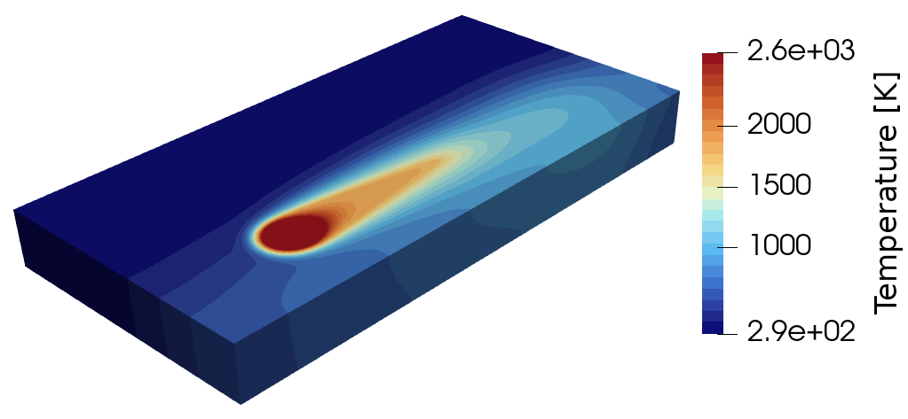

fastHeatSolv Documentation
==========================

**A fast spectral-Galerkin solver for the non-linear heat equation in metal additive manufacturing.**

fastHeatSolv resolves the transient thermal field of a scanning laser — including phase change,
evaporative cooling, and convection — on cuboid domains, driving the laser directly from G-code.
By integrating the linear diffusion exactly in a spectral eigenbasis and confining the
non-linear work to the boundary and the melt pool, it reaches finite-element fidelity while
running on both CPU and GPU backends.

   *Simulation of a laser path with fastHeatSolv.*

.. admonition:: How to get started?
   :class: tip

   Start with the :doc:`theory` (how the method works) and the :doc:`validation`
   (how it compares against analytical, finite-element, and published references). The code is
   not yet public — see :doc:`status` for access.

.. toctree::
   :maxdepth: 2
   :caption: User Guide:

   theory
   validation
   installation
   configuration
   outputs
   examples

.. toctree::
   :maxdepth: 2
   :caption: About:

   status
   citing

.. toctree::
   :maxdepth: 2
   :caption: Developer Guide:

   ARCHITECTURE
