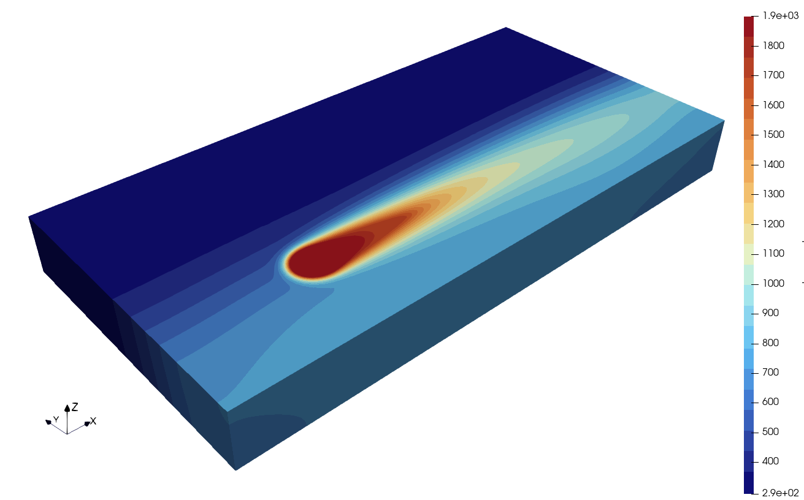

fastHeatSolv Documentation
==========================

**A semi-analytical, modular solution for the heat equation with support for CPU/GPU backends and G-code-driven laser paths.**

fastHeatSolv is a modular framework designed for simulating heat transfer in additive manufacturing. It uses semi-analytical spectral methods to achieve high performance on both CPU and GPU hardware, and fully supports complex laser trajectories parsed directly from G-code.

   *Simulation of a laser path with fastHeatSolv.*

.. toctree::
   :maxdepth: 2
   :caption: User Guide:

   installation
   theory
   configuration
   outputs
   examples

.. toctree::
   :maxdepth: 2
   :caption: Developer Guide:

   ARCHITECTURE
